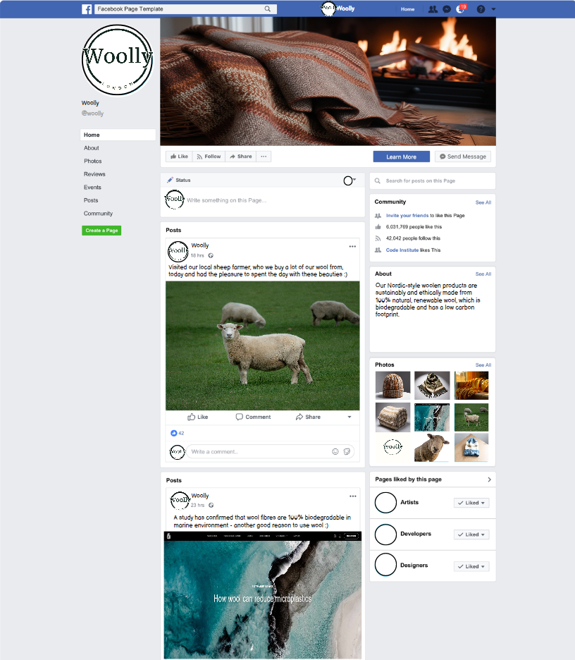

# Woolly


Woolly is a fictional e-commerce website selling sustainable, hand-made woollen products with Nordic-inspired designs.

The project was built using HTML, CSS, Python, Django, Javascript, AWS and Stripe.

Visit the deployed site [here](https://woolly-5c60edcc9498.herokuapp.com/).


## Table of Contents

## User Experience

### Project goals

* The website creates a sense of trust-worthiness and high-quality.
* The website is responsive and can easily be used on different devices.
* The style and structure of the website is consistent and intuitive to allow user to navigate the website easily.
* Users are able to create a profile to store their shipping information and view information about their past orders.
* The shop owner is able to update and remove content from the page easily.

### User Stories

An Excel spreadsheet was used to collect Epics and User Stories before development was started. Six Epics were identified to help to organise the work: 1. User Profiles, 2. Products, 3. Bag and 4. Checkout 5.Marketing 6. Comments and Ratings. These Epics were broken down into user stories with clearly defined Acceptance Criteria, Tasks, Story Points and MoSCoW prioritisation.


Before development was started the User Stories were transferred to GitHub projects that was used as a Kanban board to track user stories and the progress made.

| At the beginning  | After Iteration 1 | After Iteration 2 | After Iteration 3 | After Iteration 4 |
| ---               |  ---              |  ---              | ---               | ---               |
|  |  |  |  |  |

The Kanban board can be accessed [here](https://github.com/users/jonnlai/projects/4)

### Database Model

The database model was designed using [Lucid](https://lucid.app/). PostgreSQL object-relational database management system was used.


### Structure

The site allows for effortless and intuitive navigation due clear structure and consistent header, footer and navigation bar across all pages. [Lucid](https://lucid.app/) was used to plan the website structure.


### Wireframes

[Balsamiq](https://balsamiq.com/) User Interface wireframing tool was used to design the structure of the website.

|  Feature          |  Desktop  |  Mobile  |
|  ---              |  ---      |  ---     |
| Home              |  | |
| Products          |  |  |
| Product Detail    |  |  |
| Shopping bag      |  |  |
| Checkout          |  |  |
| Checkout success  |  |  |
| Profile           |  |  |
| Admin Dashboard   |  |  |

### Colour Scheme

Colours that evoke warmth, comfort, and natural beauty i.e earthy colours ad soft neutrals that suggest coziness and handmade craftsmanship were used across this site.

White Smoke (#F7F6F3) is used for light background areas to keep the site feeling fresh and airy. Soft Wool Cream (#F5F2E1) which is a warm, off-white color reminiscent of natural wool, was used for all the buttons. Hearty Clay (#D9A37E) was used for links to bring a rustic, cozy feel that is grounded and earthy. Autumn Maple (#C56F3A) was used mainly for hover effects. Its deep, warm orange-brown colour resembles autumn leaves or rich caramel, and evokes a sense of warmth. Deep Charcoal (#3C3C3C) was used for text.

Red was used for the 'delete' buttons to highlight the danger to avoid hikes being deleted accidently.


### Typography

Merriweather was used for the headings due to its readability and warm, and approachable feel with its rounded serifs. Poppins was used for the body due give the site a bit of modern sophistication while remaining easy to read. Its slightly rounded structure gives it a soft, friendly feel.

[Back to top ⇧](#woolly)

## Marketing

### Search Engine Optimisation (SEO)

Keywork reseach was carried out using tools such as [Google search](https://www.google.com/) and [Wordtracker](https://www.wordtracker.com/) to identify the most relevant keywords for this e-commerce business. These keywords were then added in the header element't meta tags.

As a result of the research conducted, the following short-tail and long-tail keywords were selected:

* sustainable wool products
* ethical clothing
* high-quality Nordic design
* Nordic wool blanket
* minimalist wool blanket
* warm woollen clothing
* Nordic wool
* handmade wool clothing

The effectiveness of these keywords would be monitored using tools such as Google Analytics. Based on the results, the keywords would be adjusted to reflect on what keywords have resulted in most traffic to the site.

### Business Model

Woolly is an online Business to Customer (B2C) company that offers high-quality, ethically produced, and sustainable wool products, including blankets, hats, and scarves. Inspired by minimalist Nordic design, the products appeal to eco-conscious consumers seeking timeless, stylish, and durable items.

#### Target Market

Woolly target environmentally aware individuals aged 25-45, primarily in urban areas, who value sustainability, craftsmanship, and design aesthetics. These customers are willing to pay a premium for eco-friendly, ethically sourced products.

#### Value Proposition

* Sustainability: The wool used is sourced from ethical farms that prioritise animal welfare and environmental responsibility.
* Craftsmanship: Each product is hand-made by skilled artisans, ensuring exceptional quality and attention to detail.
* Minimalist Design: Woolly's Nordic-inspired aesthetic offers timeless pieces that complement modern, minimalist lifestyles.
* Transparency: Woolly maintains clear communication about the sourcing, production, and environmental impact of our products.

#### Revenue Model

Woolly operates on a direct-to-consumer (D2C) e-commerce model, generating revenue through online sales.

#### Marketing Strategy 

Woolly leverages social media, influencer partnerships, and content marketing focused on sustainability to reach our target audience. Additionally, Woolly utilises email marketing and possibly in the future retargeting ads to boost conversions.

As an example of Woolly's planned social media presence below a mockup image of Woolly's Facebook page:



## Features

## Technologies Used

### Languages used

* [HTML5](https://en.wikipedia.org/wiki/HTML)

* [CSS3](https://en.wikipedia.org/wiki/CSS)

* [JavaScript](https://en.wikipedia.org/wiki/JavaScript)

* [Python](https://en.wikipedia.org/wiki/Python_(programming_language))

### Libraries and Frameworks used

* [Django](https://www.djangoproject.com/) web framework was used to develop the site.
   
* [Bootstrap 5](https://getbootstrap.com/docs/5.0/getting-started/introduction/) was used throughout the website to improve responsiveness and styling.

* [jQuery](https://jquery.com/) was used as a JavaScript library to help writing less JavaScript code. 

### Packages and Dependencies installed

* [Django Allauth](https://django-allauth.readthedocs.io/en/latest/) was used for user authentication, registration, and account management.

* [Django Crispy Form](https://django-crispy-forms.readthedocs.io/en/latest/) was used to control the rendering of the forms. 
 
* [Gunicorn](https://gunicorn.org/) was used as the Python Web Server Gateway Interface (WSGI) HTTP server. 

* [Django Countries](https://pypi.org/project/django-countries/) was used to provide country choices for use with forms, and a country field for models.

* [Pillow](https://pypi.org/project/Pillow/) was used to add image processing capabilities.

* [Django Storages](https://pypi.org/project/django-storages/) was used to provide a storage backend.

### Database Management

* [SQLite](https://www.sqlite.com/index.html) was used as a single-file database during development.

* [Postgres](https://www.postgresql.org/) object-relational database system was used in production.

### Payment Service

* [Stripe](https://stripe.com/en-gb-nl) was used to process all the transactions online.

### Cloud Storage

* [Amazon Web Service S3](https://aws.amazon.com/s3/) was used to store all static and media files in production.

### Tools and Programmes

* [Jinja](https://jinja.palletsprojects.com) was used as a templating engine.

* [Git](https://git-scm.com) was used for version control.

* [GitPod](https://gitpod.io/) was used for writing code, committing, and then pushing to GitHub.

* [GitHub](https://github.com) was used to store the code.

* [Heroku](https://www.heroku.com) was used to deploy the website.

* [Tiny PNG](https://tinypng.com) was used to reduce the file size of the images.

* [Pixelied](https://pixelied.com/convert/jpg-converter/jpg-to-webp) was used to convert images to WEBP format.

* [Coolors](https://coolors.co) was used to create a color scheme for the website.

* [Balsamiq](https://balsamiq.com/) was used to create the wireframes.

* [Chrome DevTools](https://developer.chrome.com/docs/devtools/) were used during development process for code review and to test responsiveness.

* [W3C Markup Validator](https://validator.w3.org/) was used to validate the HTML code.

* [W3C CSS Validator](https://jigsaw.w3.org/css-validator/) was used to validate the CSS code.

* [JSHint](https://jshint.com/) was used to validate the site's JavaScript code.

* [autopep8](https://pypi.org/project/autopep8/) was used to automatically validate the site's Python code.

* [flake8](https://flake8.pycqa.org/en/latest/) was used to validate the site's Python code.

* [Favicon.cc](https://www.favicon.cc/) was used to create the site favicon.

* [Google Fonts](https://fonts.google.com) was used to import the fonts used.

* [Font Awesome](https://fontawesome.com) was used to add icons such as social media icons.

[Back to top](#woolly)


## Testing

## Deployment

[GitPod](https://gitpod.io/) workspace was used to develop this project, and the code was committed to [Git](https://git-scm.com/) and pushed to [GitHub](https://github.com/).

This project is deployed on Heroku with static and media files stored on AWS S3.

### Stripe setup

* Log in to [Stripe](https://stripe.com/en-ie)
* Navigate to developers section (link located at the top right)
* Go to API keys tab and copy the values of PUBLIC_KEY and SECRET_KEY and add them to your env.py file
* Once your application has been deployed, navigate to the Webhooks page from the tab in the menu at the top and click on add endpoint. The link should look like this https://your_website.herokuapp.com/checkout/wh/ 
* Choose the events the webhook should recieve and add endpoint. Add SIGNING SECRET as STRIPE_WH_SECRET to your Heroku Config vars. 
* When the application is deployed, run a test transaction to ensure the webhooks are working. The events chan be checked in the webhooks page.

### AWS setup
* Log in to [AWS](https://aws.amazon.com/)

1. Create a new S3 bucket:
    * Choose the closest AWS region.
    * Add unique bucket name.
    * Under Object Ownership select ACLs enabled to allow access to the objects in the bucket.
    * Under Block Public Access settings unselect block all public access as the application will need access to the objects in the bucket.
    * Click on create bucket.

2. Edit bucket settings.
    * Bucket properties
        * Open the bucket page.
        * Go to properties tab and scroll down to website hosting and click on edit.
        * Enable static website hosting
        * Under the Hosting type section ensure Host a static website is selected.
        * Add index.html to index document field and error.html to error document field and click save.
    * Bucket permissions
        * Navigate and Click on the "Permissions" tab.
        * Scroll down to the "CORS configuration" section and click edit.
        * Enter the following snippet into the text box and click on save changes.
        ```
        [
        {
            "AllowedHeaders": [
                "Authorization"
            ],
            "AllowedMethods": [
                "GET"
            ],
            "AllowedOrigins": [
                "*"
            ],
            "ExposeHeaders": []
        }
        ]
        ```
        * Scroll to bucket policy section and click edit. Take note of the bucket arn (Example: arn:aws:s3:::test-bucket)
        * Click on policy generator and set the following settings:

            1. Select Type of Policy - S3 Bucket Policy
            2. Effect Allow
            3. Principal *
            4. AWS Service Amazon S3
            5. Actions: GetObject
            6. Amazon arn: your arn from the previous page

        * Click on add statement and then generate policy.Copy the policy
        * Paste the policy into the bucket policy editor.
        * Add "/*" to the end of the resource key to allow access to all resources in this bucket.
        * Navigate and Click Save changes.
        * For the Access control list (ACL) section, click edit and enable List for Everyone (public access) and accept the warning box. If the edit button is disabled, you need to change the Object Ownership section above to ACLs enabled (refer to Create Bucket section above).

3. Identify and Access Management (IAM)
    * Create User group
        * In the search bar, search for IAM. 
        * On the IAM page select user groups in the menu on the left.
        * Click on create user group, add a name and click create group. The users and permission policies will be added later.
    * Create Permissions policy for the user group
        * Go to Policies in the left-hand menu and click create policy
        * Click on actions and import policy.
        * Search for "AmazonS3FullAccess", select this policy, and click "Import".
        * Click "JSON" under "Policy Document" to see the imported policy
        * Copy the bucket ARN from the bucket policy page and paste it into the "Resource" section of the JSON snippet. Be sure to remove the default value of the resource key ("*") and replace it with the bucket ARN.
        * Copy the bucket ARN a second time into the "Resource" section of the JSON snippet. This time, add "/*" to the end of the ARN to allow access to all resources in this bucket.
        ```
            {
            "Version": "2012-10-17",
            "Statement": [
                {
                    "Effect": "Allow",
                    "Action": [
                        "s3:*",
                        "s3-object-lambda:*"
                    ],
                    "Resource": [
                        "arn:aws:s3:::your-project",
                        "arn:aws:s3:::your-project/*"
                    ]
                }
            ]
        }
        ```
        * On the next page add policy name and description and click create policy.

    * Attach Policy to User Group
        * Click on User Groups in the left-hand menu.
        * Click on the user group name created during the above step and select the permissions tab.
        * Click Attach Policy.
        * Search for the policy created during the above step, select it and click attach policy.

    * Create User
        * Click on Users in the left-hand menu and click on add user.
        * Enter a User name.
        * Select Programmatic access and AWS Management Console access and click next.
        * Click on add user to group, select the user group created earlier and click create user.
        * Take note of the Access key ID and Secret access key as these will be needed to connect to the S3 bucket.
        * To save a copy of the credentials click Download .csv

### Connect Django to AWS Bucket

1. Install two new packages: boto3 and django-storages. Freeze them into requirements.txt.   
   ```
   pip3 install boto3
   pip3 install django-storages 
   pip3 freeze > requirements.txt  
   ```

2. Add storages to the Installed Apps in settings.py.

3. In settings.py, we need to set cache control, set bucket configurations, set static and media files location, and override static and media URLs in production. We'll only want to do this on Heroku, so add an if statement as well.
   ```
   if 'USE_AWS' in os.environ:
      # Cache control
      AWS_S3_OBJECT_PARAMETERS = {
         'Expires': 'Thu, 31 Dec 2099 20:00:00 GMT',
         'CacheControl': 'max-age=94608000',
      }

      # Bucket Config
      AWS_STORAGE_BUCKET_NAME = 'YOUR_BUCKET_NAME'
      AWS_S3_REGION_NAME = 'YOUR_REGION'
      AWS_ACCESS_KEY_ID = os.environ.get('AWS_ACCESS_KEY_ID')
      AWS_SECRET_ACCESS_KEY = os.environ.get('AWS_SECRET_ACCESS_KEY')
      AWS_S3_CUSTOM_DOMAIN = f'{AWS_STORAGE_BUCKET_NAME}.s3.amazonaws.com'

      # Static and media files
      STATICFILES_STORAGE = 'custom_storages.StaticStorage'
      STATICFILES_LOCATION = 'static'
      DEFAULT_FILE_STORAGE = 'custom_storages.MediaStorage'
      MEDIAFILES_LOCATION = 'media' 

      # Override static and media URLs in production
      STATIC_URL = f'https://{AWS_S3_CUSTOM_DOMAIN}/{STATICFILES_LOCATION}/'
      MEDIA_URL = f'https://{AWS_S3_CUSTOM_DOMAIN}/{MEDIAFILES_LOCATION}/'
   ```

   If you have not done so yet, set the Config Vars on Heroku. On your app's dashboard on Heroku, go to Settings and click Reveal Convig Vars. Add the following variables:

   1. AWS_ACCESS_KEY_ID | your access key id from the csv file that you've downloaded before
   2. AWS_SECRET_ACCESS_KEY | your secret access key from the csv file that you've downloaded before
   3. USE_AWS | True    

   Also remove the COLLECTSTATIC variable from the Config Vars.   

4. We then want to tell Django that in production we want to use S3 to store our static files whenever someone runs collectstatic, and that we sent any uploaded images to go there as well. Create a custom_storages.py file in your project's root directory, and inside it, include the Static and Media Storage locations: 
   ```
   from django.conf import settings
   from storages.backends.s3boto3 import S3Boto3Storage
 

   class StaticStorage(S3Boto3Storage):
      location = settings.STATICFILES_LOCATION


   class MediaStorage(S3Boto3Storage):
      location = settings.MEDIAFILES_LOCATION
   ```  

5. Finally, push these changes on Github.
   ```
   git add .
   git commit -m "Your commit message"
   git push
   ```

### Deployment on Heroku

This website was deployed on Heroku as follows:

1. Create a new Heroku app:
    * Select "Create new app" in Heroku.
    * Choose a name for the app and select the location.

2. Update the code for deployment:
    * Use pip3 to install gunicorn~=20.1
    * Freeze gunicorn to requirements.txt
    * Using gunicorn and woolly wsgi file, add a command in the Procfile to start the webserver.
    * Append '.herokuapp.com' to ALLOWED_HOSTS list.
    * Ensure that DEBUG has been set to 'False' in settings.py file.

3. Deploy to Heroku:
    * Go to the 'Setting' tab and reveal 'Config vars'
    * Add the following Config vars:
        1. 'DATABASE_URL'
        2. 'SECRET_KEY'
        3. 'AWS_ACCESS_KEY_ID'
        4. 'AWS_SECRET_ACCESS_KEY'
        5. 'EMAIL_HOST_PASS'
        6. 'EMAIL_HOST_USER'
        7. 'STRIPE_PUBLIC_KEY'
        8. 'STRIPE_SECRET_KEY'
        9. 'STRIPE_WH_SECRET'
        10. 'USE_AWS' (set to True)
    * Open the new app's 'Deploy' tab and search for the correct GitHub repository.
    * Connect the Github repo to the Heroku app.
    * Manually or automatically deploy from the main branch.

### Creating a fork

1. Navigate to the [repository](https://github.com/jonnlai/woolly)
2. In the top-right corner of the page click on the fork button and select create a fork.
3. You can change the name of the fork and add description 
4. Choose to copy only the main branch or all branches to the new fork. 
5. Click Create a Fork. A repository should appear in your GitHub

### Cloning Repository

1. Navigate to the [repository](https://github.com/jonnlai/woolly)
2. Click on the Code button on top of the repository and copy the link. 
3. Open Git Bash and change the working directory to the location where you want the cloned directory. 
4. Type git clone and then paste the link.
5. Press Enter to create your local clone.

[Back to top ⇧](#woolly)

## Finished Product

## Credits

<a href="https://www.flaticon.com/free-icons/no-photo" title="no photo icons">No photo icons created by Those Icons - Flaticon</a>

Image by <a href="https://pixabay.com/users/skitterphoto-324082/?utm_source=link-attribution&utm_medium=referral&utm_campaign=image&utm_content=1822137">Rudy and Peter Skitterians</a> from <a href="https://pixabay.com//?utm_source=link-attribution&utm_medium=referral&utm_campaign=image&utm_content=1822137">Pixabay</a>

<a href="https://www.freepik.com/icon/ball_12768162#fromView=search&page=1&position=51&uuid=26393bc7-6cfc-4541-ba5e-43d6406f8774">Icon by Ylivdesign</a>

<a href="https://www.freepik.com/icon/thread_17166503#fromView=search&page=1&position=57&uuid=26393bc7-6cfc-4541-ba5e-43d6406f8774">Icon by Adury5711</a>

<a href="https://www.freepik.com/icon/wool_6651553#fromView=search&page=1&position=44&uuid=26393bc7-6cfc-4541-ba5e-43d6406f8774">Icon by PLANBSTUDIO</a>

Facebook sheep: Photo by <a href="https://unsplash.com/@wildhoney?utm_content=creditCopyText&utm_medium=referral&utm_source=unsplash">John Fowler</a> on <a href="https://unsplash.com/photos/brown-sheep-on-green-lawn-grasses-at-daytime-jmYJBQXvLNI?utm_content=creditCopyText&utm_medium=referral&utm_source=unsplash">Unsplash</a>
      

## Known Bugs