# Woolly

Woolly is a fictional e-commerce website selling sustainable, hand-made woollen products with Nordic-inspired designs.

The project was built using HTML, CSS, Python, Django, Javascript, AWS and Stripe.

Visit the deployed site [here](https://woolly-5c60edcc9498.herokuapp.com/).

## Table of Contents

## User Experience

### Project goals

* The website creates a sense of trust-worthiness and high-quality.
* The website is responsive and can easily be used on different devices.
* The style and structure of the website is consistent and intuitive to allow user to navigate the website easily.
* Users are able to create a profile to store their shipping information and view information about their past orders.
* The shop owner is able to update and remove content from the page easily.

### User Stories

An Excel spreadsheet was used to collect Epics and User Stories before development was started. Six Epics were identified to help to organise the work: 1. User Profiles, 2. Products, 3. Bag and 4. Checkout 5.Marketing 6. Comments and Ratings. These Epics were broken down into user stories with clearly defined Acceptance Criteria, Tasks, Story Points and MoSCoW prioritisation.

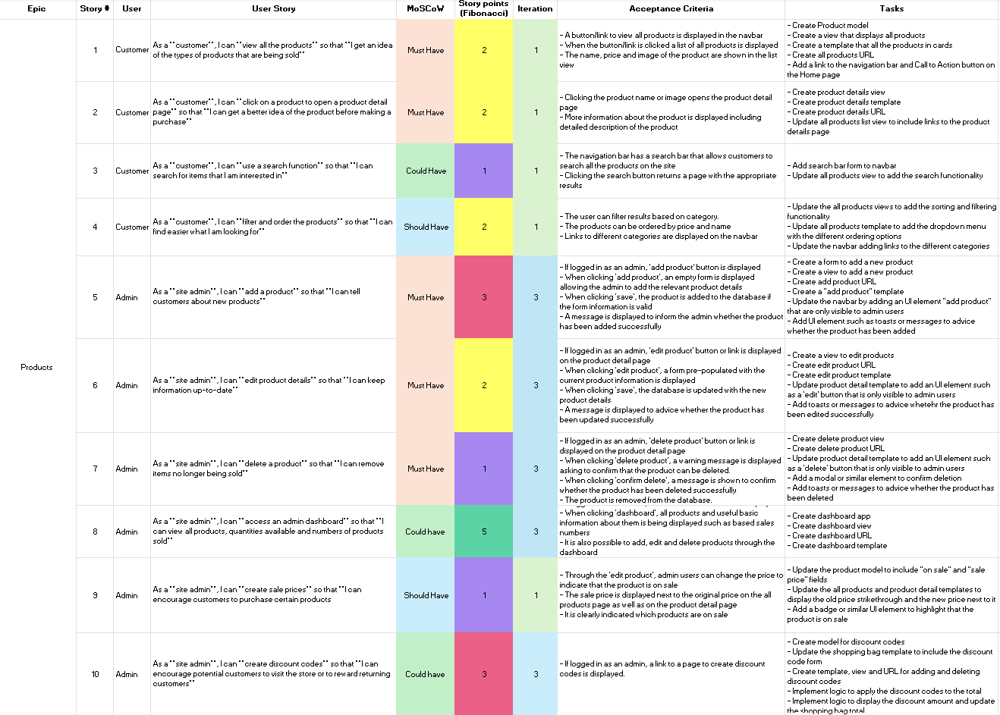
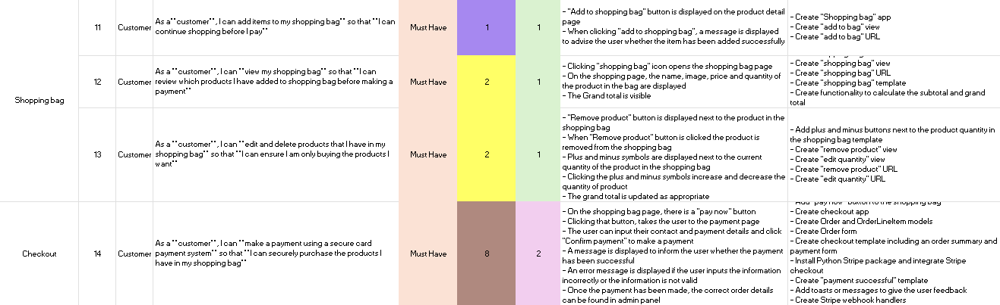

Before development was started the User Stories were transferred to GitHub projects that was used as a Kanban board to track user stories and the progress made.

| At the beginning  | After Iteration 1 | After Iteration 2 | After Iteration 3 | After Iteration 4 |
| ---               |  ---              |  ---              | ---               | ---               |
| 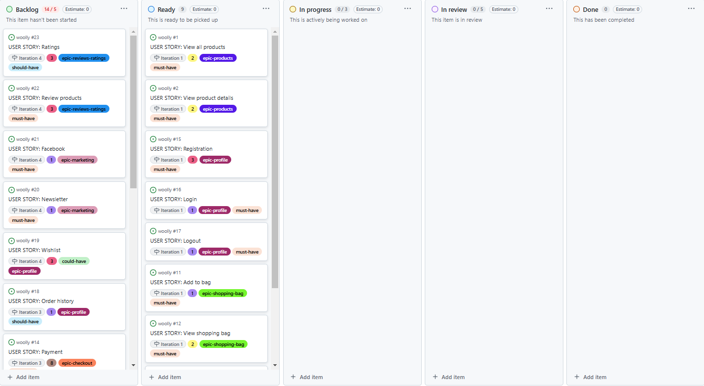 | 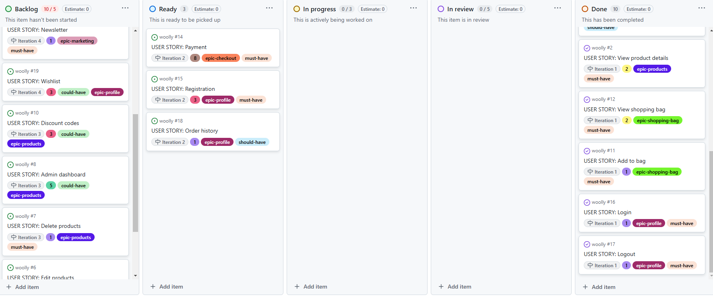 | 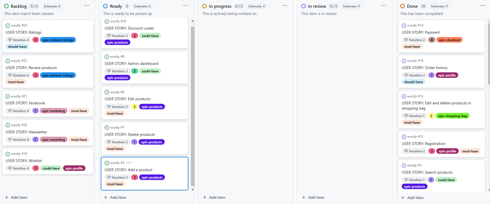 | 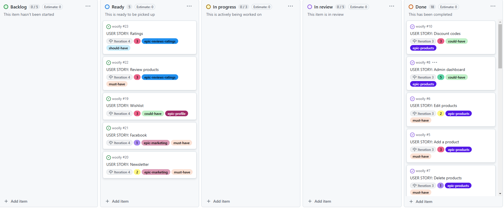 | 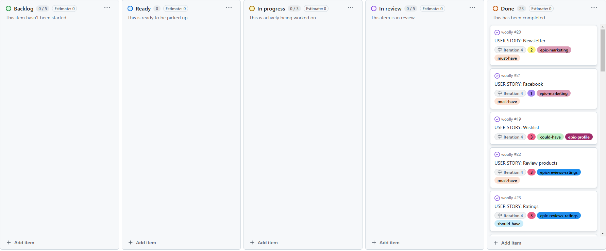 |

The Kanban board can be accessed [here](https://github.com/users/jonnlai/projects/4)

### Database Model

The database model was designed using [Lucid](https://lucid.app/). PostgreSQL object-relational database management system was used.

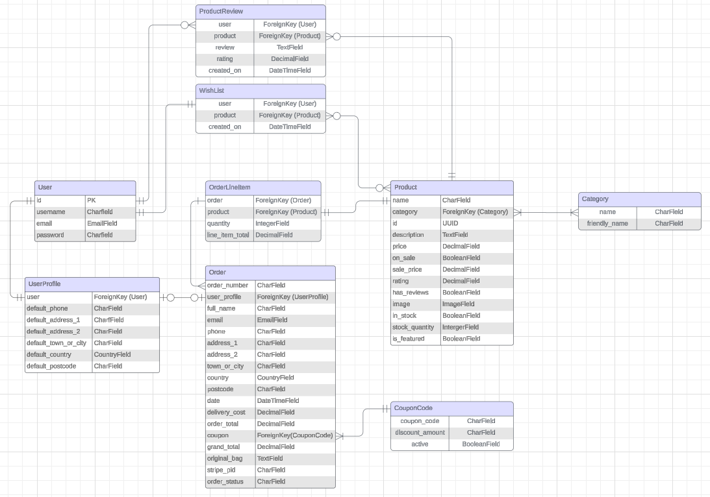

### Structure

The site allows for effortless and intuitive navigation due clear structure and consistent header, footer and navigation bar across all pages. [Lucid](https://lucid.app/) was used to plan the website structure.

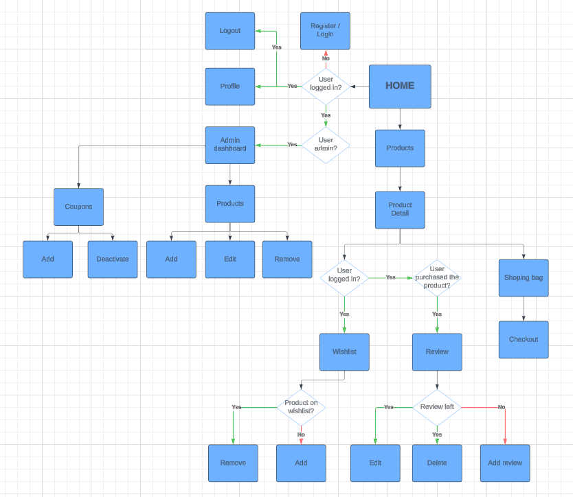

### Wireframes

[Balsamiq](https://balsamiq.com/) User Interface wireframing tool was used to design the structure of the website.

|  Feature          |  Desktop  |  Mobile  |
|  ---              |  ---      |  ---     |
| Home              | 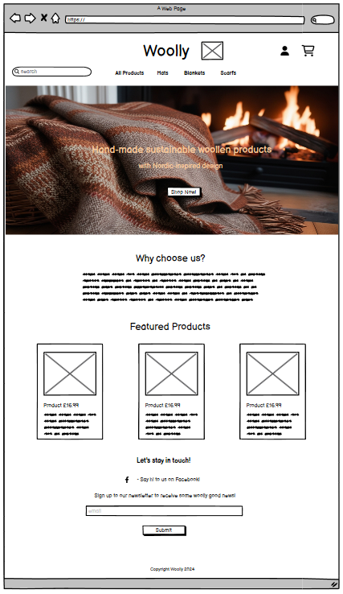 | 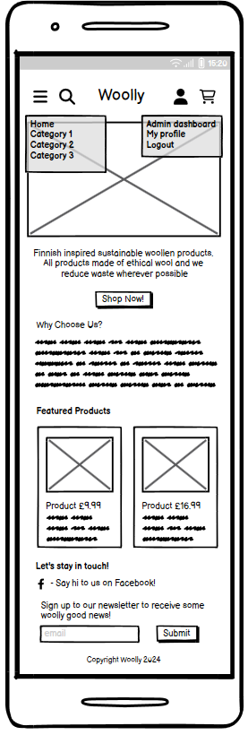|
| Products          | 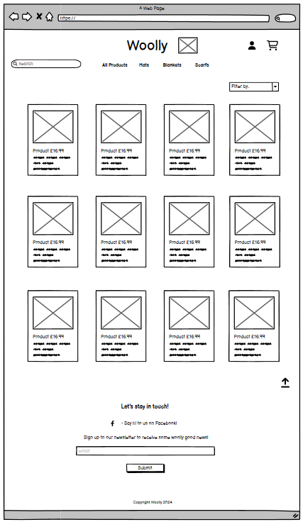 | 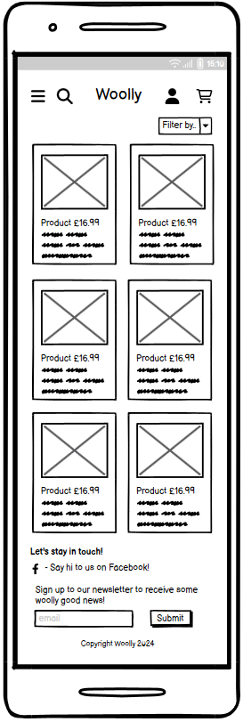 |
| Product Detail    | 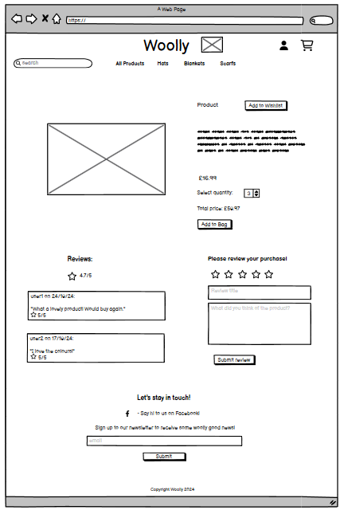 | 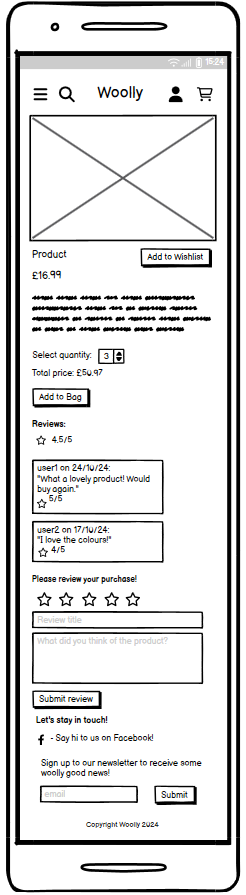 |
| Shopping bag      | 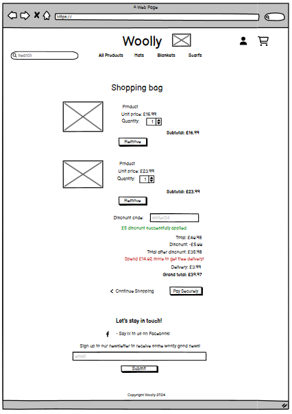 | 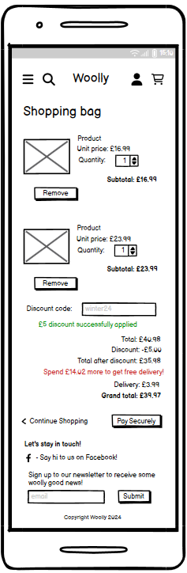 |
| Checkout          | 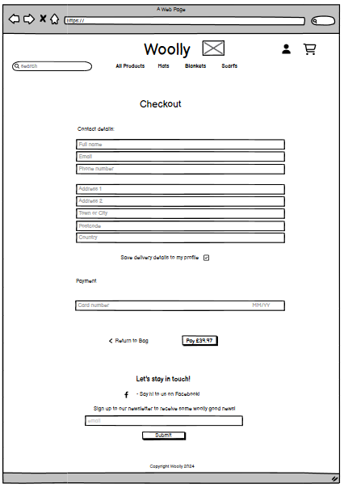 | 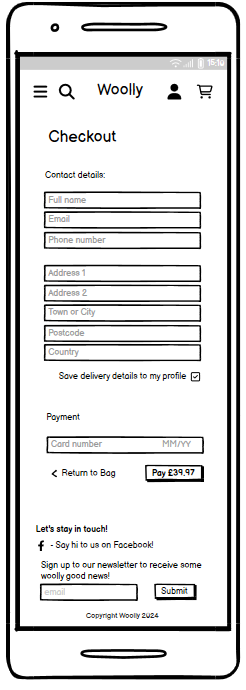 |
| Checkout success  | 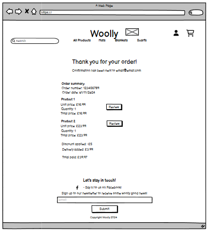 | 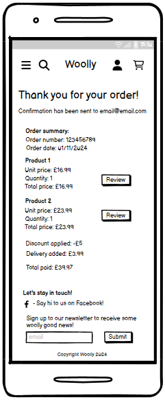 |
| Profile           | 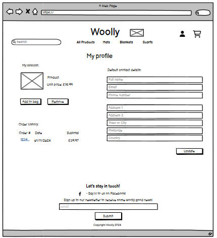 | 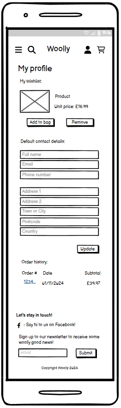 |
| Admin Dashboard   | 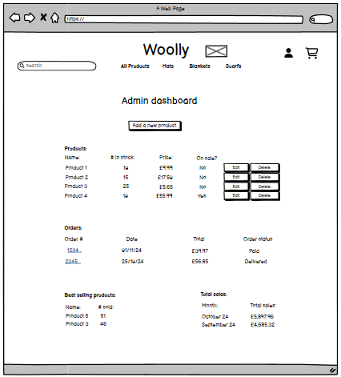 | 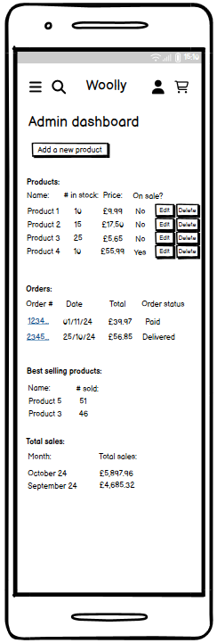 |

### Colour Scheme

Colours that evoke warmth, comfort, and natural beauty i.e earthy colours ad soft neutrals that suggest coziness and handmade craftsmanship were used across this site.

White Smoke (#F7F6F3) is used for light background areas to keep the site feeling fresh and airy. Soft Wool Cream (#F5F2E1) which is a warm, off-white color reminiscent of natural wool, was used for all the buttons. Hearty Clay (#D9A37E) was used for links to bring a rustic, cozy feel that is grounded and earthy. Autumn Maple (#C56F3A) was used mainly for hover effects. Its deep, warm orange-brown colour resembles autumn leaves or rich caramel, and evokes a sense of warmth. Deep Charcoal (#3C3C3C) was used for text.

Red was used for the 'delete' buttons to highlight the danger to avoid hikes being deleted accidently.

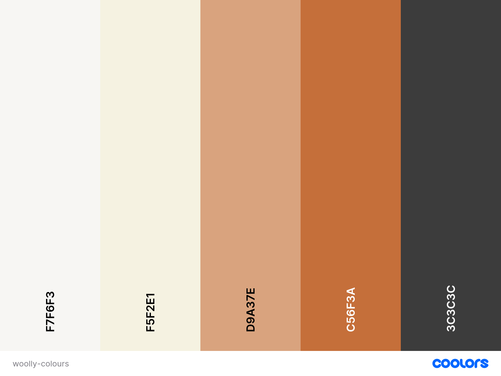

### Typography

Merriweather was used for the headings due to its readability and warm, and approachable feel with its rounded serifs. Poppins was used for the body due give the site a bit of modern sophistication while remaining easy to read. Its slightly rounded structure gives it a soft, friendly feel.

[Back to top ⇧](#woolly)

## Marketing

## Features

## Technologies Used

### Languages Used

### Languages used

* [HTML5](https://en.wikipedia.org/wiki/HTML)

* [CSS3](https://en.wikipedia.org/wiki/CSS)

* [JavaScript](https://en.wikipedia.org/wiki/JavaScript)

* [Python](https://en.wikipedia.org/wiki/Python_(programming_language))

### Libraries and Frameworks used

* [Django](https://www.djangoproject.com/) web framework was used to develop the site.
   
* [Bootstrap 5](https://getbootstrap.com/docs/5.0/getting-started/introduction/) was used throughout the website to improve responsiveness and styling.

* [jQuery](https://jquery.com/) was used as a JavaScript library to help writing less JavaScript code. 

### Packages and Dependencies installed

* [Django Allauth](https://django-allauth.readthedocs.io/en/latest/) was used for user authentication, registration, and account management.

* [Django Crispy Form](https://django-crispy-forms.readthedocs.io/en/latest/) was used to control the rendering of the forms. 
 
* [Gunicorn](https://gunicorn.org/) was used as the Python Web Server Gateway Interface (WSGI) HTTP server. 

* [Django Countries](https://pypi.org/project/django-countries/) was used to provide country choices for use with forms, and a country field for models.

* [Pillow](https://pypi.org/project/Pillow/) was used to add image processing capabilities.

* [Django Storages](https://pypi.org/project/django-storages/) was used to provide a storage backend.

### Database Management

* [SQLite](https://www.sqlite.com/index.html) was used as a single-file database during development.

* [Postgres](https://www.postgresql.org/) object-relational database system was used in production.

### Payment Service

   * [Stripe](https://stripe.com/en-gb-nl) was used to process all the transactions online.

### Cloud Storage

* [Amazon Web Service S3](https://aws.amazon.com/s3/) was used to store all static and media files in production.

### Tools and Programmes

* [Jinja](https://jinja.palletsprojects.com) was used as a templating engine.

* [Git](https://git-scm.com) was used for version control.

* [GitPod](https://gitpod.io/) was used for writing code, committing, and then pushing to GitHub.

* [GitHub](https://github.com) was used to store the code.

* [Heroku](https://www.heroku.com) was used to deploy the website.

* [Tiny PNG](https://tinypng.com) was used to reduce the file size of the images.

* [Pixelied](https://pixelied.com/convert/jpg-converter/jpg-to-webp) was used to convert images to WEBP format.

* [Coolors](https://coolors.co) was used to create a color scheme for the website.

* [Balsamiq](https://balsamiq.com/) was used to create the wireframes.

* [Chrome DevTools](https://developer.chrome.com/docs/devtools/) were used during development process for code review and to test responsiveness.

* [W3C Markup Validator](https://validator.w3.org/) was used to validate the HTML code.

* [W3C CSS Validator](https://jigsaw.w3.org/css-validator/) was used to validate the CSS code.

* [JSHint](https://jshint.com/) was used to validate the site's JavaScript code.

* [autopep8](https://pypi.org/project/autopep8/) was used to automatically validate the site's Python code.

* [flake8](https://flake8.pycqa.org/en/latest/) was used to validate the site's Python code.

* [Favicon.cc](https://www.favicon.cc/) was used to create the site favicon.

* [Google Fonts](https://fonts.google.com) was used to import the fonts used.

* [Font Awesome](https://fontawesome.com) was used to add icons such as social media icons..

[Back to top](#woolly)

## Testing

## Deployment

## Finished Product

## Credits

<a href="https://www.flaticon.com/free-icons/no-photo" title="no photo icons">No photo icons created by Those Icons - Flaticon</a>

Image by <a href="https://pixabay.com/users/skitterphoto-324082/?utm_source=link-attribution&utm_medium=referral&utm_campaign=image&utm_content=1822137">Rudy and Peter Skitterians</a> from <a href="https://pixabay.com//?utm_source=link-attribution&utm_medium=referral&utm_campaign=image&utm_content=1822137">Pixabay</a>

<a href="https://www.freepik.com/icon/ball_12768162#fromView=search&page=1&position=51&uuid=26393bc7-6cfc-4541-ba5e-43d6406f8774">Icon by Ylivdesign</a>

<a href="https://www.freepik.com/icon/thread_17166503#fromView=search&page=1&position=57&uuid=26393bc7-6cfc-4541-ba5e-43d6406f8774">Icon by Adury5711</a>

<a href="https://www.freepik.com/icon/wool_6651553#fromView=search&page=1&position=44&uuid=26393bc7-6cfc-4541-ba5e-43d6406f8774">Icon by PLANBSTUDIO</a>

## Known Bugs