# Woolly Testing

Return to Woolly's [README.md file](https://github.com/jonnlai/woolly#woolly).

You can visit the deployed site [here](https://woolly-5c60edcc9498.herokuapp.com/).

## Table of Contents

1. [Testing User Stories](#testing-user-stories)
2. [Code Validation](#code-validation)
3. [Performance and Accessibility](#performance-and-accessibility)
4. [Responsiveness](#responsiveness)
5. [Manual Testing](#manual-testing)
6. [Unit Testing](#unit-testing)

## Testing User Stories

### Epic 1 - Products

1. As a **customer**, I can **view all the products** so that **I get an idea of the types of products that are being sold**.
    * Products page is available. The page lists all the products and their basic details such as name of the product, price and rating.

2. As a **customer**, I can **click on a product to open a product detail page** so that **I can get a better idea of the product before making a purchase**.
    * A product details page is available. The page gives more detailed information about the product such as its description and reviews from other customers if available.

3. As a **customer**, I can **use a search function** so that **I can search for items that I am interested in**.
    * A search bar is available and prominantly displayed in the navigation bar. The function allows the user to input a search word and all products contain that word in their name or description are displayed to the user.

4. As a **customer**, I can **filter and order the products** so that **I can find easier what I am looking for**.
    * Links to lists of products filtered by product categories or whether the product is on sale are displayed in the navigation bar. When viewing products on the products page, a customer can also use the sort function to order and filter products based on price, name or category name.

5. As a **site admin**, I can **add a product** so that **I can tell customers about new products**.
    * Full CRUD functionality has been implemented: the site admin can access an admin dashboard through which new products can be added. Clicking 'add product' button takes the site admin to the 'add new product' form. Correctly completing the form and clicking 'submit' button, adds the product to the site.

6. As a **site admin**, I can **edit product details** so that **I can keep information up-to-date**.
    * Full CRUD functionality has been implemented: through the admin dashboard or via 'edit' link on the product detail page, the site admin can access 'edit product' page. Any valid edits are saved and displayed to the site users.

7. As a **site admin**, I can **delete a product** so that **I can remove items no longer being sold**.
    * Full CRUD functionality has been implemented: through the admin dashboard or via 'delete' link on the product detail page, the site admin can access 'delete product' modal. Clicking 'delete' on the modal, removes the product from the site. A modal was added to ensure that products are not being deleted accidently.

8. As a **site admin**, I can **access an admin dashboard** so that **I can view all products, quantities available and numbers of products sold**.
    * Through the admin dashboard, the site admin can view a list of all products, their quantities, prices and whether they are on sale. The admin dashboard also displays all coupon codes, orders and the total number that each product has sold.

9. As a **site admin**, I can **create sale prices** so that **I can encourage customers to purchase certain products**.
    * Using the 'edit product' function, the site admin can create sale prices. Products that have sale prices are highlighted using a 'sale' badge.

10. As a **site admin**, I can **create discount codes** so that **I can encourage potential customers to visit the store or to reward returning customers**.
    * Through the admin dashboard, the site admin can access form to create new discount codes. The site can also deactivate the codes through the dashboard.

### Epic 2 - Shopping Bag

11. As a **customer**, I can **add items to my shopping bag** so that **I can continue shopping before I pay**.
    * A customer can click 'add to bag' button on the product detail page to add the desired product to their shopping bag. The product remains in their shopping bag until its removed or purchased or the session is ended.

12. As a **customer**, I can **view my shopping bag** so that **I can review which products I have added to shopping bag before making a payment**.
    * A customer can click 'view bag' button to view their shopping bag. They are taken to their shopping bag and displays basic information about all the products their have added.

13. As a **customer**, I can **edit and delete products that I have in my shopping bag** so that **I can ensure I am only buying the products I want**.
    * A customer can open their shopping bag and adjust the amounts or delete products using the UI elements on the page.

14. As a **customer**, I can **make a payment using a secure card payment system** so that **I can securely purchase the products I have in my shopping bag**
    * A customer can make a payment using secure Stripe card payment platform. The Stripe checkout is embedded on the site.

### Epic 3 - User Profile

15. As a **website user**, I can **register as a customer and create a user profile** so that **I can store details in my profile**.
    * Clicking 'register' link on the navigation bar, allows the website user to create a user profile and store their delivery information in their profile.

16. As a **registered user**, I can **login** so that **I can access my profile information**.
    * There is a 'login' link that takes the user to a login page that allows registered users to log into their profiles.

17. As a **registered user**, I can **logout** so that **I can stop others from accessing my personal information**.
    * Registered, logged in users are displayed a 'logout' link in the navigation bar. This takes users to a page that asks them to confirm their want to log out. After comfirming that they want to log out, the user is logged out.

18. As a **registered user**, I can **view my order history** so that **I can check which products I have previously bought**.
    * Registered users can view their order history on their profile page.

19. As a **customer**, I can **add products to my Wishlist** so that **if I am not ready to purchase an item yet, I can find these products easily when I decide to come back to make a purchase**.
    * Registered users can add products to their wishlist by clicking a heart icon on the product detail page. They view products on their wishlist and remove products from their wishlist through their user profile page. If product is on the users wishlist, this is indicated on the product detail page and the heart icon is hidden.

### Epic 4 - Marketing

20. As a **customer**, I can **sign up to receive a newsletter** so that **I can receive news and offers via email**.
    * Any customers or potential customers can sign up to receive a newsletter by adding their email address to the newsletter mailing list.
    * After submitting their address, the customer receives a welcome email from the company.

21. As a **customer**, I can **find the business on social media such as Facebook** so that **I can interact with the business and other customers informally and thus, getting a sense of community**
    * There is a link to Facebook in the footer element encouraging the site users to stay in touch with the company through social media.
    * Mockup of the company's Facebook page has been included in the README.md file.

### Epic 5 - Rating and Comments

22. As a **registered customer**, I can **leave a review of the product** so that **I can share my opinion with other potential buyers**
    * Registered customers who have purchased the product can and are encouraged to leave a review of the product.
    * The review form is displayed on the product detail page, when appropriate, and there is a link in the order history on the profile page that takes the registered user to review form.
    Full CRUD functionality has been implemented: registered users can create, read, update and delete their reviews.

23. As a **registered customer**, I can **rate the products that I have bought** so that **I can help other customers to choose which product to buy**.
    * Using the review form, registered customers who have purchased the product can rate the product in the scale of 1-5. 
    * The avarage rating is displayed on the product detail page and the product list.

[Back to top ⇧](#woolly-testing)

## Code Validation

The [W3C Markup Validator](https://validator.w3.org/), [W3C CSS Validator](https://jigsaw.w3.org/css-validator/) and [JSHint](https://jshint.com/) were used to validate the HTML, CSS and JS code to ensure that the project meets the current Web Standards and is free from any unintended syntax errors and mistakes that could cause issues with accessibility and usability. [autopep8](https://pypi.org/project/autopep8/), [Flake8](https://flake8.pycqa.org/en/latest/) and [CI Python Linter](https://pep8ci.herokuapp.com/#) were used to validate the Python code.

### HTML

* W3C Markup Validator highlighted the following errors that were corrected.

| Error                                                                 | Action taken                           |
| ---                                                                   | ---                                    |
| 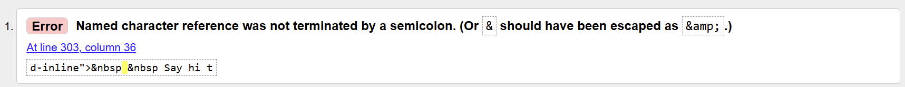       | The missing semicolon was added        |
| 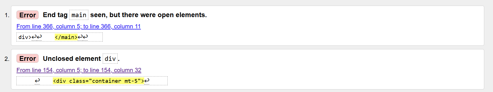 | The missing div was added              |
| 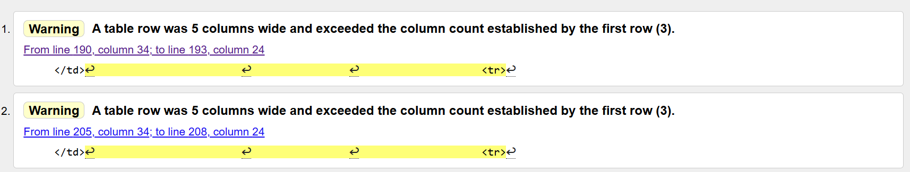           | This missing table rows were added     |
| 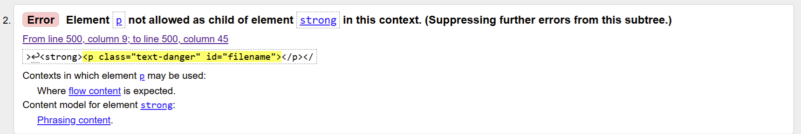     | The strong element was removed         |
| 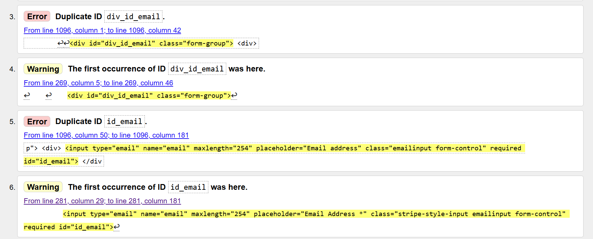 | The issue was caused by having two crispy forms on the same page. The duplicate ids were created by crispy forms. The issue was solved by not using crispy to render the newsletter form which only consisted of an email input field. |
| 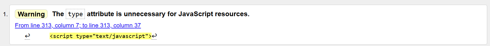| This was left unresolved as it is a warning rather than an error and the code comes from the CI boutique ago walkthrough project |

### CSS

All CSS files was validated using [W3C CSS Validator](https://jigsaw.w3.org/css-validator/). No error were found.

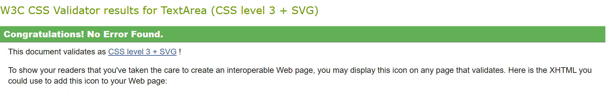

### Python

[autopep8](https://pypi.org/project/autopep8/), [Flake8](https://flake8.pycqa.org/en/latest/) and [CI Python Linter](https://pep8ci.herokuapp.com/#) were used throghout development to validate the Python code for PEP8 requirements.

Several whitespace and indentation errors as well as errors regarding unused imports were identified and these were rectified where possible.

* Some issues highlighted by Flake8, some of which are shown below, were ignored as they related to migration files, settings, .env and .vscode files only. The developer is currently studying how to ignore those files when using Flake8 to validate code.
* As the developer was new to using Flake8, all the Python code was also validated using CI Python Linter to ensure PEP8 compliance. No errors were found, an example of below.

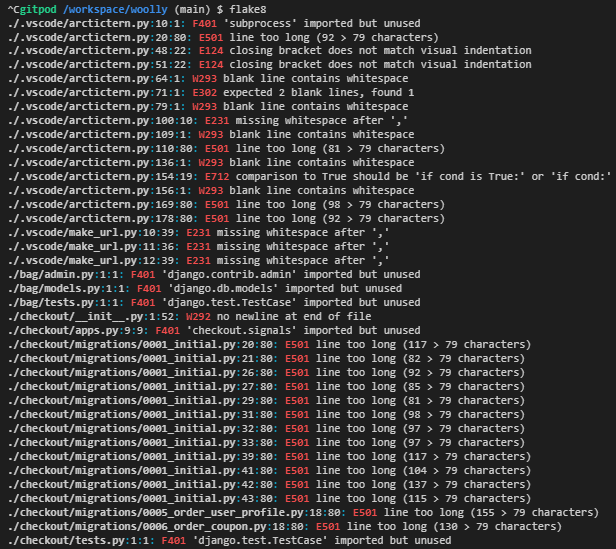
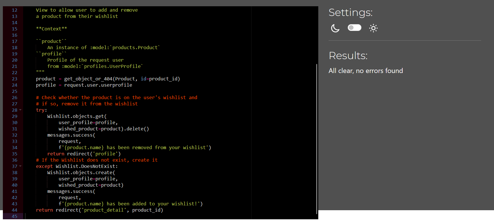

### Javascript

[JSHint](https://jshint.com/) warned about missing semicolons, these were added. Two undefined variables 'size' were also noted. These removed as they were unnecessary.

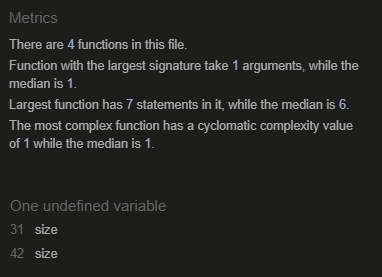

JSHint also highlighted variables that it considered undefined. These variables (Stripe, bootstrap) from head element of the base.html file and therefore these were ignored.

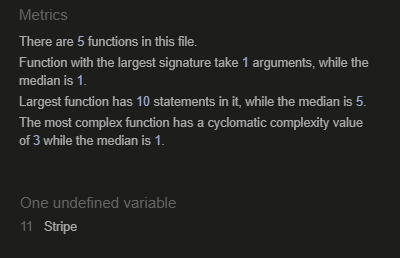

[Back to top ⇧](#woolly-testing)

## Performance and Accessibility

Chrome DevTool Lighthouse was used to assess the project's performance and accessibility. The reports confirmed that the page performs well and is accessible. The recommendations relating to Best Practice noted that, because of AWS and Stripe, the site is using third party cookies, which lowers the Best Practices score. Some of the recommendation to improve Performace relate to AWS and Stripe and render-blocking resources. 

| Page tested       | Report                                                                                |
| ---               | ---                                                                                   |
| Home              | 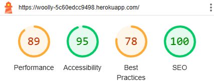                           |
| Products          | 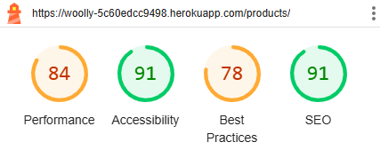                   |
| Product detail    | 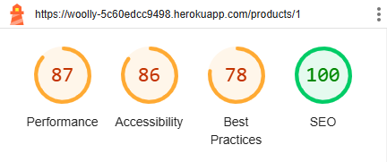       |
| Shopping bag      | 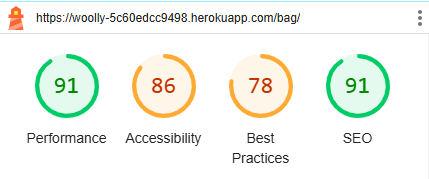                             |
| Checkout          | 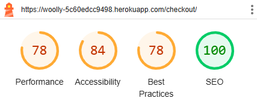                   |
| Checkout success  | 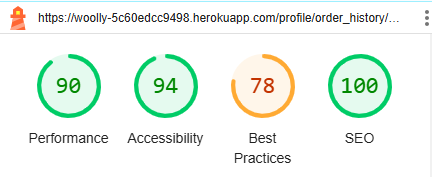   |
| Profile           | 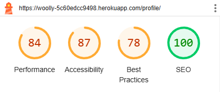                     |
| Admin Dashboard   | 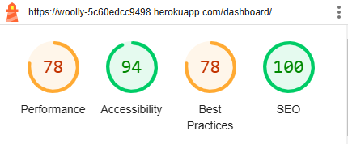                 |

[Back to top ⇧](#woolly-testing)

## Responsiveness

In addition to manual checks, responsiveness was tested further using [Chrome DevTools](https://developer.chrome.com/docs/devtools/) during the development process to test the responsiveness.

[Back to top ⇧](#woolly-testing)

## Manual Testing

### Browser compatibility

| Browser          | Outcome                                                  | Pass/Fail |
| ---              | ---                                                      | ---       |
| Google Chrome    | No appearance, responsiveness nor functionality issues.  | Pass      |
| Mozilla Firefox  | No appearance, responsiveness nor functionality issues.  | Pass      |
| Microsoft Edge   | No appearance, responsiveness nor functionality issues.  | Pass      |
| Samsung Internet | No appearance, responsiveness nor functionality issues.  | Pass      |

### Device compatibility

| Device                 | Outcome                                                 | Pass/Fail |
| ---------------------- | ------------------------------------------------------- | --------- |
| Sony Xperia 10 III     | No appearance, responsiveness nor functionality issues. | Pass      |
| Samsung Galaxy A55     | No appearance, responsiveness nor functionality issues. | Pass      |
| Lenovo Yoga s730       | No appearance, responsiveness nor functionality issues. | Pass      |
| Sony VAIO 15"          | No appearance, responsiveness nor functionality issues. | Pass      |
| Dell P2419H 24" screen | No appearance, responsiveness nor functionality issues. | Pass      |
| Samsung Galaxy Tab S4  | No appearance, responsiveness nor functionality issues. | Pass      |

### Common Elements Testing

* **Navigation bar**

    | Feature               | Outcome                                                                                                           | Pass/Fail |
    | ---                   | ---                                                                                                               | ---       |
    | Brand name            | Redirects to the home page                                                                                        | Pass      |
    | Home link             | Redirects to the main page/hikes list. When the page is active, the font colour turns darker.                     | Pass      |
    | All Products link     | Redirects to the all products page. When active, the link is darker.                                              | Pass      |
    | Clothing link         | Redirects to the page that displays all products filtered by 'clothing category'. When active, the link is darker.| Pass      |
    | Homeware link         | Redirects to the page that displays all products filtered by 'homeware category'. When active, the link is darker.| Pass      |
    | Sale link             | Redirects to the page that displays all products filtered by 'on_sale' field. When active, the link is darker.    | Pass      |
    | Account dropdown      | The word 'account' is hidden on small screens, icon is always displayed. Dropdown works as expected.              | Pass      |
    | Logout                | Only displayed when logged in. Redirects to the logout page.                                                      | Pass      |
    | Login                 | Only displayed when not logged in. Redirects to the login page.                                                   | Pass      |
    | Register              | Only displayed when not logged in. Redirects to the registration page.                                            | Pass      |
    | Profile link          | Only displayed to registered users. Takes the user to their own profile page.                                     | Pass      |
    | Shopping cart link    | Displays the current total. Cart icon is hidden on small screens. Clicking the cart takes the user to their bag.  | Pass      |
    | Admin Dashboard link  | Only displayed to site admins/superusers. Takes the site admin to the admin dashboard                             | Pass      |
    | Hamburger menu        | Navigation menu works as expected on smaller devices. Hidden on larger devices.                                   | Pass      |
    | Search bar            | Search bar is displayed below brand name. Inputting a search term returns a list of relevat products.             | Pass      |

* **Footer**

    | Feature               | Outcome                                                                                                                               | Pass/Fail |
    | ---                   | ---                                                                                                                                   | ---       |
    | Facebook icon         | Opens Facebook on a separate tab.                                                                                                     | Pass      |
    | Privacy Policy        | Opens the privacy policy on a separate tab.                                                                                           | Pass      |
    | Newsletter sign up    | User is able to input an email address. The email is added to the database and user receives a welcome email and a confirmation toast.| Pass      |

* **Home Page**

    | Feature               | Outcome                                                                                                                               | Pass/Fail |
    | ---                   | ---                                                                                                                                   | ---       |
    | View products button  | Clicking the button takes the user to the all products page                                                                           | Pass      |
    | Chevron               | Clicking the chevron takes the user to the about us section.                                                                          | Pass      |
    | IWTO logo             | Clicking the logo, open IWTO's website on a new tab.                                                                                  | Pass      |
    | Woolmark logo         | Clicking the logo, open Woolmarks's website on a new tab.                                                                             | Pass      |
    | Featured products     | Three on sale products are displayed under the Featured products heading.                                                             | Pass      |

* **Products Page**

    | Feature               | Outcome                                                                                                                               | Pass/Fail |
    | ---                   | ---                                                                                                                                   | ---       |
    | Sort function         | Selecting a sort value from the dropdown, orders the products as expected in the requested order                                      | Pass      |
    | Back to top button    | Clicking the bottom takes the user to the top of the page.                                                                            | Pass      |
    | Product list          | Products are displayed correctly, depending on the screen size 1-4 products per row.                                                  | Pass      |

* **Product detail Page**

    | Feature               | Outcome                                                                                                                               | Pass/Fail |
    | ---                   | ---                                                                                                                                   | ---       |
    | Wishlist icon         | Icon is only displayed if the user is logged in. Clicking the icon add the product to their wishlist and the icon disappears.         | Pass      |
    | Wishlist link         | Wishlist link is displayed if the product is on the user's wishlist. The link takes the user to their profile page                    | Pass      |
    | Adjust qty buttons    | Clicking the buttons adjust the quantity as expected. Negative values are shown but they cannot be selected.                          | Pass      |
    | Adjust qty input      | The quantity input field works as expected. An error message is shown if the user tries to add quantity that is < 0 or > 99.          | Pass      |
    | Stock amount          | The stock amount is displayed correctly.                                                                                              | Pass      |
    | Add to bag button     | Clicking the button adds the requested amount in the bag. If the requested amount is above the stock amount an error message is shown. If the product is not in stock or stock amount is zero, the add to bag button is disabled                                                                              | Pass      |
    | Keeping shopping btn  | Clicking the button takes the user back to the all products page.                                                                     | Pass      |
    | Reviews               | If there are any reviews, they are displayed below the product detail section. If there are no reviews, that is stated instead.       | Pass      |
    | Edit review link      | Edit link is displayed below the review if the user is the author of the review. Clicking the link takes them to edit review form     | Pass      |
    | Delete review link    | Works as the edit review link. Clicking 'delete' opens a modal. Clicking 'delete' on the modal, deletes the review.                   | Pass      |
    | Product rating        | Product rating is displayed below the price. The rating updates based on the ratings users give.                                      | Pass      |
    | Review form           | Review form is displayed only if the user is logged in and has purchased the product. If they are not logged in or have not purchased the product, they are advised to login or leave a review should decide to purchase the product.                                                                              | Pass      |
    | Sale price            | If the product is on sale, the sale price is displayed next to the original price that has been crossed over.                         | Pass      |
    | Edit product link     | Edit link is displayed if the user is a superuser. Clicking the buttons takes them to edit product form                               | Pass      |
    | Delete product link    | Works as the edit product link. Clicking 'delete' opens a modal. Clicking 'delete' on the modal, deletes the product.                | Pass      |

* **Add Product Page**

    | Feature               | Outcome                                                                                                                               | Pass/Fail |
    | ---                   | ---                                                                                                                                   | ---       |
    | Form validation       | The form cannot be submitted without name, description, price and stock amount added.                                                 | Pass      |
    | Select image button   | Lets the site admin to add an image                                                                                                   | Pass      |
    | Cancel button         | Clicking the button takes the admin user back to the admin dashboard.                                                                 | Pass      |
    | Add product button    | If the form is valid, clicking the button, add the product to the database and displays it on the website.                            | Pass      |

* **Edit Product Page**

    | Feature               | Outcome                                                                                                                               | Pass/Fail |
    | ---                   | ---                                                                                                                                   | ---       |
    | Remove image tickbox  | Selecting 'remove', removes the image when the form is submitted. The default no-image image is displayed on the product page.        | Pass      |
    | Update product button | If the form is valid, clicking the button, updates the database and displays the updated information on the website                   | Pass      |
    | Cancel button         | Clicking the button takes the admin user back to the admin dashboard.                                                                 | Pass      |

* **Shopping Bag Page**

    | Feature               | Outcome                                                                                                                               | Pass/Fail |
    | ---                   | ---                                                                                                                                   | ---       |
    | Adjust qty buttons    | Clicking the buttons adjust the quantity as expected. Negative values are shown but they cannot be selected.                          | Pass      |
    | Adjust qty input      | The quantity input field works as expected. An error message is shown if the user tries to add quantity that is < 0 or > 99.          | Pass      |
    | Update qty link       | Clicking the link updates the amount. If the requested amount is above the stock amount an error message is shown.                    | Pass      |
    | Remove link           | Clicking 'remove' removes the product from the shopping bag.                                                                          | Pass      |
    | Keeping shopping btn  | Clicking the button takes the user back to the all products page.                                                                     | Pass      |
    | Secure checkout button| Clicking the button takes the user to the checkout pag.                                                                               | Pass      |
    | Product name link     | Clicking the product name takes the user back to the product page.                                                                    | Pass      |

* **Secure Checkout Page**

    | Feature               | Outcome                                                                                                                               | Pass/Fail |
    | ---                   | ---                                                                                                                                   | ---       |
    | Checkout form         | An order gets created on Stripe and the database when a valid form is submitted. Errors are highlighted to the user.                  | Pass      |
    | Coupon code form      | A message is displayed to inform whether the code is valid. If a code is valid and the order total is above the minimum amount, the discount amount is displayed and the order total is updated accordingly.                                                                                                 | Pass      |
    | Login link            | Clicking the link takes the user to the sign in page.                                                                                 | Pass      |
    | Register link         | Clicking the link takes the user to the account sign up page.                                                                         | Pass      |
    | Save Info checkbox    | Checking the box saves the delivery and contact information in the user's user profile.                                               | Pass      |
    | Adjust Bag link       | Clicking the link takes the user back to their shopping bag.                                                                          | Pass      |

* **Checkout Success Page**

    | Feature                   | Outcome                                                                             | Pass/Fail |
    | ---                       | ---                                                                                 | ---       |
    | Shop more products link   | Clicking the link takes the user to the all products page                           | Pass      |

* **Profile Page**

    | Feature               | Outcome                                                                                                                               | Pass/Fail |
    | ---                   | ---                                                                                                                                   | ---       |
    | Wishlist              | Wishlist is displayed if any producted have been added to the wishlist. If user has not added any products, a link to products is displayed |Pass |
    | Wishlist - 'Buy' btn  | Clicking 'buy' takes the user to the product detail page.                                                                             | Pass      |
    | Wishlist - bin icon   | Clicking the icon removes the product from the wishlist. No confirmation modal is available as the user is not deleting anything.     | Pass      |
    | Wishlist - name link  | Clicking the product name takes the user to the product page.                                                                         | Pass      |
    | Delivery info form    | The user is able to update their default delivery information. Clicking 'save' stores their information on their profile.             | Pass      |
    | Reviews               | User's reviews are displayed if they have left any. Otherwise, a text to inform the user they have not reviewed any products is shown | Pass      |
    | Reviews - name link   | Clicking the name of the product takes the user to the product detail page.                                                           | Pass      |
    | Order history         | Order history is displayed if the user has bought any products. Otherwise, they are encouraged to view the products.                  | Pass      |
    | Order history - review link | On larger screens a 'review' link is displayed next to each product purchased. Clicking the link takes the user to the product detail page where they can leave a product review                                                                                                                            | Pass     |
    | Order history - order number | Clicking the number takes the user to the order confirmation page.                                                              | Pass     |

* **Admin Dashboard**

    | Feature               | Outcome                                                                                                                               | Pass/Fail |
    | ---                   | ---                                                                                                                                   | ---       |
    | Add a product button  | Clicking the button takes the superuser to the add product page. An error message is shown if someone else tries to access the page.  | Pass      |
    | Add coupon code button| Clicking the button takes the superuser to the add coupon page. An error message is shown if someone without admin credential attempts to access the page.                                                                                                                                                       | Pass      |
    | Deactivate link       | Clicking the 'deactivate' link deactivates the coupon code. No confirmation modal was added as no information is being deleted.       | Pass      |
    | Products - name link  | Clicking the link takes the user to the product detail page.                                                                          | Pass      |
    | Products - edit link  | Clicking 'edit' takes the user to the 'edit product' page.                                                                            | Pass      |
    | Orders - order number | Clicking the order number takes the user to the order confirmation page.                                                              | Pass      |

* **Create a Coupon Page**

    | Feature               | Outcome                                                                                                                               | Pass/Fail |
    | ---                   | ---                                                                                                                                   | ---       |
    | Form validation       | The form cannot submitted without coupon code and amount being added.                                                                 | Pass      |
    | Add button            | Clicking 'add coupon' created a new coupon code.                                                                                      | Pass      |
    | Cancel button         | Clicking 'cancel' takes the user back to the admin dashboard                                                                          | Pass      |

* **Authentication**

    | Feature               |   Outcome                                                                         | Pass/Fail |
    | ---                   |  ---                                                                              | ---       |
    | Login                 | Works as expected.                                                                | Pass      |
    | Register              | Works as expected. Sends the user a confirmation email                            | Pass      |
    | Logout                | Works as expected.                                                                | Pass      |
    | Confirm email button  | Clicking the confirm button, confirms the email address.                          | Pass      |
    | Forgot password button| Clicking the button takes the user to password reset page.                        | Pass      |
    | Reset password        | Works as expected. The user receives an password reset email.                     | Pass      |

[Back to top ⇧](#woolly-testing)

## Unit Testing

[Back to top ⇧](#woolly-testing)

